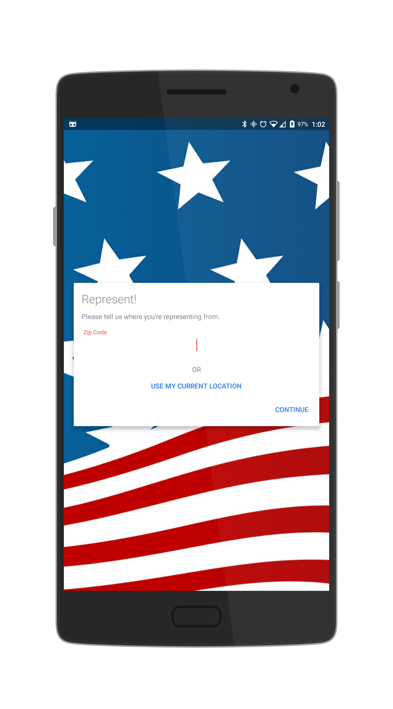
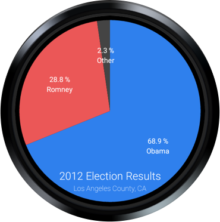

# Represent!

An app for people in the US to see the representatives for their area, or any area in the US. The app shows the representatives info along with one of their recent tweets, and offers more info such as committees they are on or bills they have sponsored. There is also an Android Wear companion app that displays the representatives name, party, and type, as well as shows the 2012 election results for the current area. In addition, when the watch is shook, a random location is chosen and the phone and watch are updated to reflect the information of the representatives from the random location that is chosen.

## Authors

Gus Silva ([gus7silva@berkeley.edu](mailto:gus7silva@berkeley.edu))

## Demo Video

See [Video Walkthrough] (https://youtu.be/diJY8a1a11Y)

## Screenshots

  

    
     
    Upon opening the app, the user is asked to enter their location, or use the GPS to find their current location. 
  
    
  
  

    
     
    The user is then shown the type, name, party, email, website, photo, and latest tweet of each representative for that area. The companion watch app is also automatically launched, displaying the representatives in a horizontally scrolling view. 
  
   
  
  

    
     
    Once the user presses 'MORE INFO' from mobile, or clicks a representative from the watch, they are taken to this screen on their phone, which shows the dates serving, recent committees, and recently sponsored bills of the seleted representative.  
  
   
  
  

  
     
    Swiping all the way right in the watch shows the results of the 2012 election voting for the given location. 
  
   

## Acknowledgments

* nostr13:  UniversalImageLoader
* Google: Volley
* mcxiaoke: Volley mirror for easy gradle import
* PhilJay: MPAndroidChart
